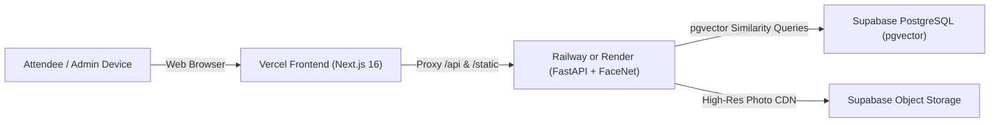

# 🚀 EventLens AI — Complete Production Cloud Deployment Guide

This guide provides tested, step-by-step instructions to deploy **EventLens AI** across **Railway**, **Render**, **Supabase**, and **Vercel** with maximum performance, AI facial search, and seamless cross-service communication.

---

## 📑 Architecture Overview



- **Frontend**: [Vercel](https://vercel.com) (Next.js 16, Global Edge CDN, SSL, Zero-Config API Proxy)
- **Backend Service**: [Railway](https://railway.app) or [Render](https://render.com) (FastAPI, PyTorch FaceNet, YuNet detector)
- **Database & Storage**: [Supabase](https://supabase.com) (PostgreSQL with `pgvector` & S3-compatible Storage)

---

## 🗄️ Step 1: Set Up Supabase (Database + pgvector + Storage)

1. Create a project at [supabase.com](https://supabase.com).
2. Open the **SQL Editor** in your Supabase dashboard.
3. Open [`backend/schema.sql`](file:///c:/Users/Santhosh/Downloads/stitch_hello_world_project%20%281%29/stitch_hello_world_project%20%281%29/backend/schema.sql), copy its entire contents, paste into the Supabase SQL editor, and click **Run**.
   - This automatically enables the `vector` extension.
   - Creates all tables (`events`, `photos`, `face_embeddings`, `person_clusters`, `share_tokens`, `audit_logs`, `event_settings`, `sync_jobs`).
   - Creates the Cosine Similarity HNSW index (`idx_face_embeddings_vector`).
   - Creates the `match_face_embeddings` RPC function.
   - Initializes the public `photos` storage bucket and access policies.
4. Go to **Project Settings** -> **API**:
   - Copy **Project URL** (e.g. `https://xyzproject.supabase.co`).
   - Copy **service_role secret key** (needed by backend for fast vector indexing).

---

## 🚂 Step 2: Deploy Backend to Railway (Recommended)

1. Go to [railway.app](https://railway.app) and click **New Project** -> **Deploy from GitHub repo**.
2. Select your repository (`Santhosh-555-i/my-website` or `Santhosh-555-i/photo`).
3. Railway will automatically detect [`railway.json`](file:///c:/Users/Santhosh/Downloads/stitch_hello_world_project%20%281%29/stitch_hello_world_project%20%281%29/railway.json) / [`backend/Dockerfile`](file:///c:/Users/Santhosh/Downloads/stitch_hello_world_project%20%281%29/stitch_hello_world_project%20%281%29/backend/Dockerfile).
4. Go to **Variables** and add:
   | Key | Example Value | Description |
   |---|---|---|
   | `PORT` | `8000` | Server listening port |
   | `DB_MODE` | `supabase` | Set to `supabase` (or `sqlite` for local test) |
   | `SUPABASE_URL` | `https://xyzproject.supabase.co` | Your Supabase Project URL |
   | `SUPABASE_SERVICE_ROLE_KEY` | `eyJhbGciOi...` | Supabase Service Role Secret Key |
   | `ADMIN_EMAIL` | `santosh2005th@gmail.com` | Admin dashboard login email |
   | `ADMIN_PASSWORD` | `your_secure_password` | Admin dashboard password |
   | `ADMIN_JWT_SECRET` | `generate_random_32_character_key` | JWT signing secret |
   | `SIMILARITY_THRESHOLD` | `0.68` | Face matching sensitivity (0.60 - 0.75) |
   | `CORS_ORIGINS` | `https://*.vercel.app,http://localhost:3000` | Allowed frontend domains |
5. Go to **Settings** -> **Networking** -> click **Generate Domain** to get your public URL (e.g. `https://photo-production.up.railway.app`).
6. Test health check: `https://photo-production.up.railway.app/api/health` -> returns `{"status":"healthy"}`.

---

## 🛠️ Step 2 (Alternative): Deploy Backend to Render

### Option A: 1-Click Render Blueprint
1. Go to [dashboard.render.com](https://dashboard.render.com/) and click **New +** -> **Blueprint**.
2. Connect your GitHub repository. Render will automatically detect [`render.yaml`](file:///c:/Users/Santhosh/Downloads/stitch_hello_world_project%20%281%29/stitch_hello_world_project%20%281%29/render.yaml).
3. Fill in the environment variables and click **Apply**.

### Option B: Manual Web Service on Render
1. Click **New +** -> **Web Service**.
2. Select your repository.
3. Configure:
   - **Name**: `eventlens-backend`
   - **Environment**: `Docker`
   - **Docker Context**: `.` (or `./backend`)
   - **Dockerfile Path**: `./backend/Dockerfile` (or `./Dockerfile`)
   - **Health Check Path**: `/api/health`
4. Add the same Environment Variables as in the Railway table above.
5. Click **Create Web Service** and note your public Render URL (e.g. `https://eventlens-backend.onrender.com`).

---

## 🌐 Step 3: Deploy Frontend to Vercel

1. Go to [vercel.com](https://vercel.com) and click **Add New...** -> **Project**.
2. Import your GitHub repository.
3. In the project configuration:
   - **Framework Preset**: `Next.js`
   - **Root Directory**: Click *Edit* and select **`frontend`** (or leave default if deploying from monorepo).
4. Under **Environment Variables**, add:
   | Key | Example Value | Description |
   |---|---|---|
   | `BACKEND_INTERNAL_URL` | `https://photo-production.up.railway.app` | Backend URL on Railway/Render |
   | `NEXT_PUBLIC_BACKEND_URL` | `https://photo-production.up.railway.app` | Public backend fallback URL |
   | `NEXT_PUBLIC_API_URL` | `/api` | Relative proxy prefix |
5. Click **Deploy**. Vercel will build and assign your live production URL (e.g. `https://eventlens-ai.vercel.app`)!

---

## 🐳 Step 4: Self-Hosted Docker Compose (VPS / Local)

To run the entire stack on any Linux VPS (Ubuntu, Debian) or local Docker:

```bash
# Clone the repository
git clone https://github.com/Santhosh-555-i/my-website.git
cd photo

# Launch frontend and backend containers
docker compose up -d --build
```

- Frontend: `http://localhost:3000`
- Backend API Docs: `http://localhost:8000/docs`

---

## 🧪 Step 5: Post-Deployment Verification Checklist

- [ ] **Health Check**: Open `https://<your-backend>/api/health` -> verify status is `"healthy"`.
- [ ] **Interactive API Docs**: Open `https://<your-backend>/docs` -> verify FastAPI Swagger UI opens.
- [ ] **Frontend Homepage**: Open `https://<your-frontend>.vercel.app` -> verify smooth loading and animations.
- [ ] **Admin Login**: Go to `https://<your-frontend>.vercel.app/admin` -> login with your `ADMIN_EMAIL` and `ADMIN_PASSWORD`.
- [ ] **Create Event**: Create a new event code (e.g. `GALA-2026`) and upload batch photos.
- [ ] **Attendee Face Search**: Go to `https://<your-frontend>.vercel.app/event/GALA-2026`, capture a selfie, and verify matches return in < 1 second.
- [ ] **Photo Sharing**: Select photos -> click "Share Selected Photos" -> test opening the temporary link in an incognito window.
- [ ] **Automated Test Suite**: Run `python backend/test_deployment_readiness.py` to confirm 100% test pass rate.
