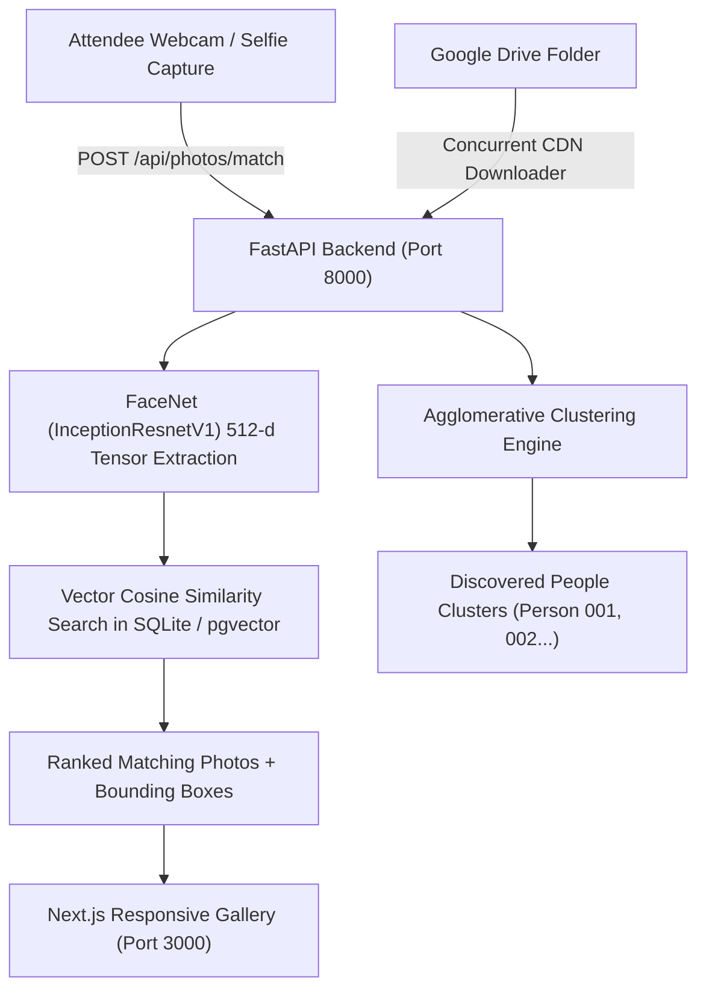

# 📸 EventLens AI — Selfie-Based Event Photo Finder

An AI-powered event photography platform that automatically identifies attendees in event photographs and allows guests to find their personal photos by snapping a single selfie.

---

## 🌟 Key Features

### 1. 🧠 High-Precision Face Recognition
- **FaceNet (`InceptionResnetV1` trained on VGGFace2)** deep neural network running directly via PyTorch tensors.
- Generates calibrated **512-dimensional facial vector embeddings**.
- Calculates **Cosine Similarity** to match individuals across varying lighting, angles, and facial expressions.

### 2. 👥 Automatic Person Discovery & Clustering
- Automatically clusters identical faces across all event photos into distinct people profiles (**"Person 001"**, **"Person 002"**, etc.).
- Admin tools to **rename**, **merge**, or **split** person clusters.
- Per-person photo appearance count and thumbnail preview strips.

### 3. ⚡ High-Speed Google Drive Import Engine
- Direct Google CDN streaming (`ThreadPoolExecutor` concurrent pipeline) to import public folders or file links in seconds.
- Avoids large local file duplication by streaming and optimizing thumbnails.

### 4. 🔒 Privacy, Security & Governance
- **Zero Raw Biometric Storage**: Attendee selfies are processed strictly in-memory during vector extraction and discarded immediately.
- **Passcode-Protected Events**: Protect event downloads behind an organizer passcode.
- **GDPR Biometric Erasure**: 1-click option to erase all facial vector embeddings while preserving original photographs.
- **Security Audit Logs**: Track all admin actions, cluster merges, and downloads.

### 5. 🔗 Secure Temporary Sharing Links (`/my-photos/<token>`)
- Guests can generate time-limited private sharing links (e.g. 24h, 48h, 7 days) to share their matched photos with family without login or exposing biometric data.

### 6. 📦 Comprehensive Download Suite
- **Download All My Photos (.ZIP)** in 1 click.
- **Download Entire Event Gallery (.ZIP)**.
- **Multi-Select Checkmark Mode**.
- **Individual High-Resolution Original Download**.

---

## 🚀 Quickstart Guide

### Prerequisites
- Python 3.10+
- Node.js 18+ and npm

---

### Step 1: Run the Backend

```powershell
cd "backend"
python -m uvicorn app.main:app --reload --port 8000
```
- **API Server**: `http://localhost:8000`
- **Swagger Interactive API Docs**: `http://localhost:8000/docs`

---

### Step 2: Run the Frontend

```powershell
cd "frontend"
npm run dev
```
- **Web App**: `http://localhost:3000`

---

## 🔑 Default Administrator Credentials

- **Admin Portal**: [`http://localhost:3000/admin`](http://localhost:3000/admin)
- **Designated Super Admin Email**: `satosh2005th@gmail.com`
- **Passcode**: `admin123`

---

## 🏗️ Architecture & Tech Stack



- **Frontend**: Next.js 16 (Turbopack), React 19, Tailwind CSS, Lucide Icons, Canvas Confetti.
- **Backend**: FastAPI, PyTorch 2.2, torchvision, facenet-pytorch, OpenCV, PIL, SQLite / Supabase pgvector.
- **ML Models**: InceptionResnetV1 (VGGFace2), Haar Cascade Multi-scale Face Detector.

---

## 🧪 Automated Testing

To run the full end-to-end integration and real-world selfie matching test suite:

```powershell
cd "backend"
python test_selfie_match_real.py
python test_api_full.py
```
